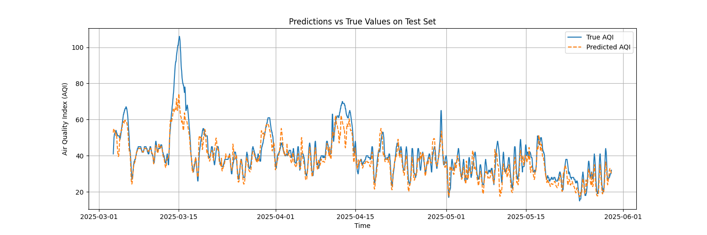

# Torch Weather

This portion of the code handles the extraction, transformtaion, model fitting,
and hyperparameter tuning of the Air Quality model.

A visual flow diagram will be coming soon

### Model Choice
I chose an LSTM model for this project as they are able to perform well for
small datasets. Given that we have hourly data from January 1, 2023 to present
day, that gives approximately 22K data points. I also have a hardware
restriction in a 2017 macbook pro that is nearly out of storage and only 8GB of
RAM. Given this, I wanted something that could perform well with very tight
requirements like this. Obviously if I had access to a better system and GPU's
I could explore something like Transformers to model this, but I am satisfied
with the performance of this model for now. We also make use of a lookback window of 12 timepoints (the last 12 hours) to help with prediciting the next hour's air quality

### Data Transformation
Within the data included in this model, air quality is the main thing we wish to
model. Due to the western Canada wildfires, especially in 2023, we have a
fairly heavily right-skewed target variable. As such, I log transformed the
data. Now, in terms of numerical scaling, I wanted to ensure the model was still
able to differentiate the outliers from other variables, hence I used robust
scaling rather than others. Also, a time series model like this wants to include
some sort of cyclical time component, as air quality can fluctuate in a given
year (Ie: worse in summers because of fires, pollution, etc). Therefore, I
created a customer scikit-learn transformer to handle the transformation of
these time features. We then pacakged everything into a scikit-learn pipeline so
that it can be easily resused in additional pieces of code later on, especially
when deployed in an API.

### The Model
As I said, an LSTM model was used in this case as it is able to perform well for
small datasets. This can be verified from my initial results, as I was getting
surprising performance given my available data. Additionally, to achieve the
best possible model we can, I incorporated hyperparameter tuning into the model.

#### Optuna
While hyperaparameter tuning techniques like grid-search or randomzied-search
can work well, they require the user to define the values to be considered in
the model, which can drastically increase both the complexity and time taken to
train the model. Rather than train this way, I wanted to use Optuna to conduct
bayesian hyperparameter tuning of my model parameters. This way, the tuning will
handle suggestion of new parameters after each successive run, working towards
the best cominbation possible. Again, given my hardware requirements, I am only
able to run ~15 different traisl before my computer really starts to take off to
outer space, but ideally this would be longer, giving ample time to tune a
model. Once the best hyperparameters are found, we train the model on the
combined training and validation data, but leave test data untouched. We do this
using the best hyperparameter combination found during the training cycle

#### Overfitting concerns
Another issue with such a small dataset as this is overfitting. Since we have a
small dataset when looking at deep learning standards, I need to employ
techniques to ensure that my model is not overfitting during training, as that
would have horrible impact when it comes to actual applications. To prevent
this, I make use of early stopping, in conjunction with Optuna's ability to
prune trials if they are not promising. This ensures that model training is
stopped before overfitting can fully take hold, and will conserve resources if
the tested hyperparameters are poor performers.

### Logging Model training
To get visibility into model performance during training, MLFlow is used to log
parameters and metrics during the hyperparameter tuning phase. This way, I can
get better visibility into individual runs of the training cycle. We also use
Minio as the tracking server backend rather than an on-host system. Then, when
it comes to fitting the final model, we log the final model, parameters, model
artifacts including the scikit-learn pipeline, and additional to MLFlow. We then
push this model to the model registry to be used in deployment.

### Overall performance
Overall, I was getting better than expected performance with this model. As I
said, we have a fairly small dataset in terms of deep learning needs, and found
that I was getting an RMSE between 3-4 for the final model fits. An example
figure below shows the predicted vs actual air quality of a final model fits

